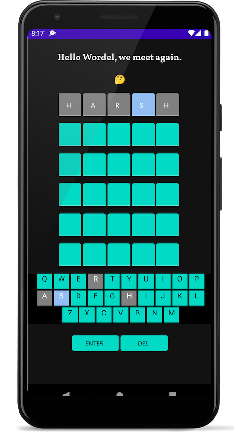

# HelloWordel

## An Android clone for the popular wordle game, built in jetpack compose.

- Uses a single activity screen with flow, hilt (DI) and jetpack compose UI components

## Works with Light and Dark Mode.

## Deeplinking for challenging other players.

